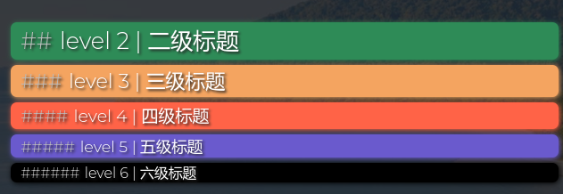
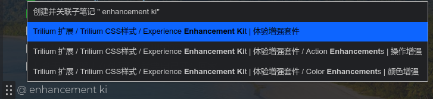
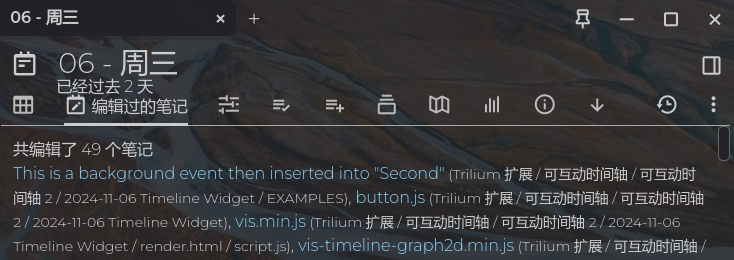
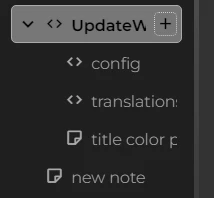

Here is the revised version with corrected spelling and grammar:

# Trilium Enhancement

[中文说明](README_CN.md)

Please stand up and stretch your body for a while if you see this :)

**Enhance Your Experience**

Experience Enhancement Kit for Trilium Notes

My Trilium is quite different from yours :) I'm here to share some of my creations that can improve your experience with Trilium.

# Enhancements

## Color Enhancements

### Title Background

Default:

Enhanced:

Modified from https://github.com/SiriusXT/trilium-theme-blue, thanks to SiriusXT!

### Calendar

Default:

Enhanced:

Modified from https://github.com/Nriver/awesome-trilium/issues/30, thanks to XXXJetfireXXX!

### @ Option

The default `@` option in Dark theme:

Enhanced:

By Nriver

### Note Path

Make the cloned note paths more distinguishable.

Default:

Enhanced:

By Nriver

### Edited Note List

Default:

Enhanced:

Moded from https://github.com/zadam/trilium/discussions/2670, thanks to wouterbatelaan-es!

### Change Clone Icon

Change note clone icon to DNA symbol with `sandy brown` color which displays clearly in both light theme and dark theme.

Default:

Enhanced:

## Action Enhancements

### Note Tree Scroll Bar

Default:

Enhanced:

From https://github.com/zadam/trilium/discussions/4706, thanks to SiriusXT

### New Note Button

Move the add note button to the front, in case the `horizontal scrollbar for note tree` makes the button go out of the panel. Also, the possibility of hitting the new note button by mistake is reduced.

Default:

Enhanced:

By Nriver

### Wide Quick Search

Quick search with no width limit. You can see everything now.

Default:

Enhanced:

It also works for the `@ option` which you can see in the previous screenshot.

By Nriver

# How to Install

1. Download the zip file from the [release page](https://github.com/Nriver/trilium-enhancement/releases).
2. Right-click the note tree in Trilium and click import, uncheck `Safe Import`.
3. Restart Trilium Notes or use `ctrl+r` to reload the interface.
4. Have fun.

# Hints

1. The screenshots are taken with [bing-daily-theme](https://github.com/Nriver/bing-daily-theme).
2. The colors are designed to work on most of the themes. You can tweak them if you want.
3. If you are using a light theme instead of a dark theme like I do, you may want to uncomment the CSS for the light theme in the `title background` note.

# Why I Made This?

Trilium is great. There are some little tweaks I can do to make it greater. And here we are.

# Donation

Hello! If you appreciate my creations, kindly consider backing me. Your support is greatly appreciated. Thank you!

Ko-fi:  

Alipay:  

WeChat Pay:  
