以下是译文：

# Trilium 增强工具包

[English Description](README.md)

看到这里，请站起来活动一下身体 :)

**提升您的体验**

Trilium Notes 的体验增强工具包

我的 Trilium 和你们的不太一样 :) 我在这里分享一些我的创作，可以提升你使用 Trilium 的体验。

# 增强功能

## 颜色增强

### 标题背景

默认:

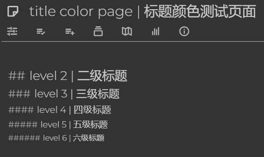

增强:

改编自 https://github.com/SiriusXT/trilium-theme-blue，感谢 SiriusXT！

### 日历

默认:

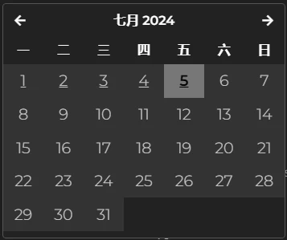

增强:

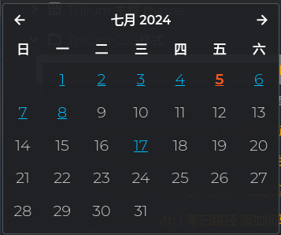

改编自 https://github.com/Nriver/awesome-trilium/issues/30, 感谢 XXXJetfireXXX！

### @ 选项

黑暗主题下的默认 `@` 选项:

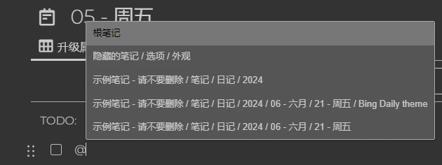

增强:

由 Nriver 提供

### 笔记路径

使克隆笔记的路径更易区分。

默认:

增强:

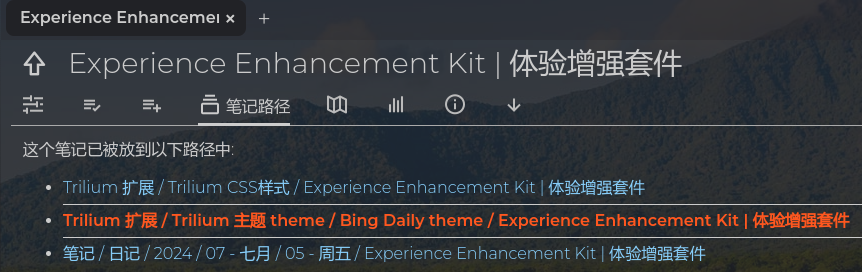

由 Nriver 提供

### 编辑的笔记列表

默认:

增强:

改编自 from https://github.com/zadam/trilium/discussions/2670, 感谢 wouterbatelaan-es!

### 修改克隆笔记图标

修改笔记克隆图标为DNA图标，同时修改为 沙褐色 ，这样在明亮和黑暗的主题里都能清楚显示

默认:

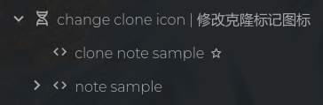

增强:

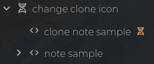

由 Nriver 提供

## 操作增强

### 笔记树横向滚动条

默认:

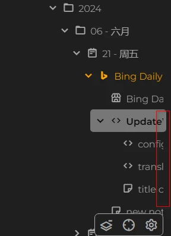

增强:

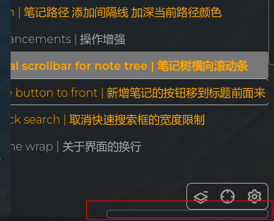

来自 https://github.com/zadam/trilium/discussions/4706，感谢 SiriusXT

### 新建笔记按钮

将添加笔记按钮移动到前面，以防 `笔记树的水平滚动条` 使按钮超出面板。另外，减少了误点击新建笔记按钮的可能性。

默认:

增强:

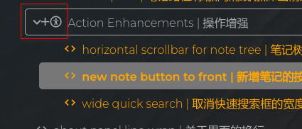

由 Nriver 提供

### 宽搜索栏

无限宽度的快速搜索。现在你可以看到所有内容。

默认:

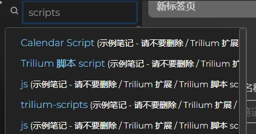

增强:

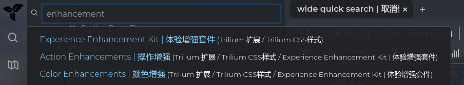

它同样适用于前一个截图中看到的 `@ 选项`。

由 Nriver 提供

# 如何安装

1. 从[发布页面](https://github.com/Nriver/trilium-enhancement/releases)下载 zip 文件。
2. 右键点击 Trilium 中的笔记树，选择导入，取消勾选 `安全导入`。
3. 重启 Trilium Notes 或使用 `ctrl+r` 重新加载界面。
4. 尽情享用。

# 提示

1. 截图使用了 [bing-daily-theme](https://github.com/Nriver/bing-daily-theme)。
2. 这些颜色设计适用于大多数主题。如果你愿意，可以调整它们。
3. 如果你使用的是像我一样的暗色主题之外的亮色主题，你可能需要在 `标题背景` 笔记中取消注释亮色主题的 CSS。

# 我为什么要做这个？

Trilium 很棒。我可以做一些小调整使它更棒。所以做了这些增强功能。

# 捐赠

你好！如果你欣赏我的创作，请考虑支持我。非常感谢你的支持！

Ko-fi:  

支付宝:  

微信支付:  
